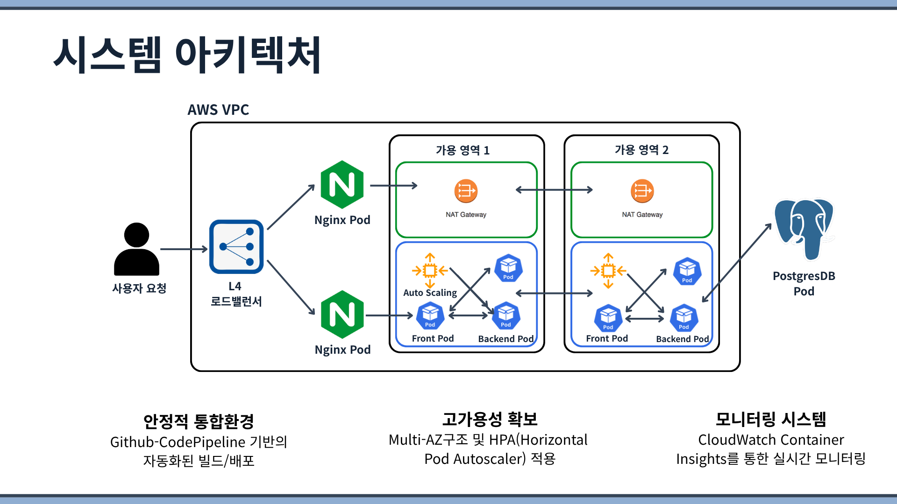
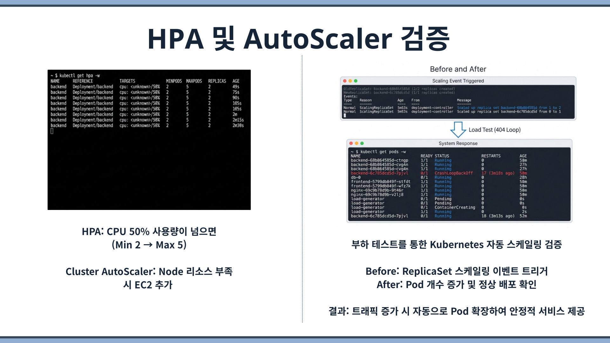
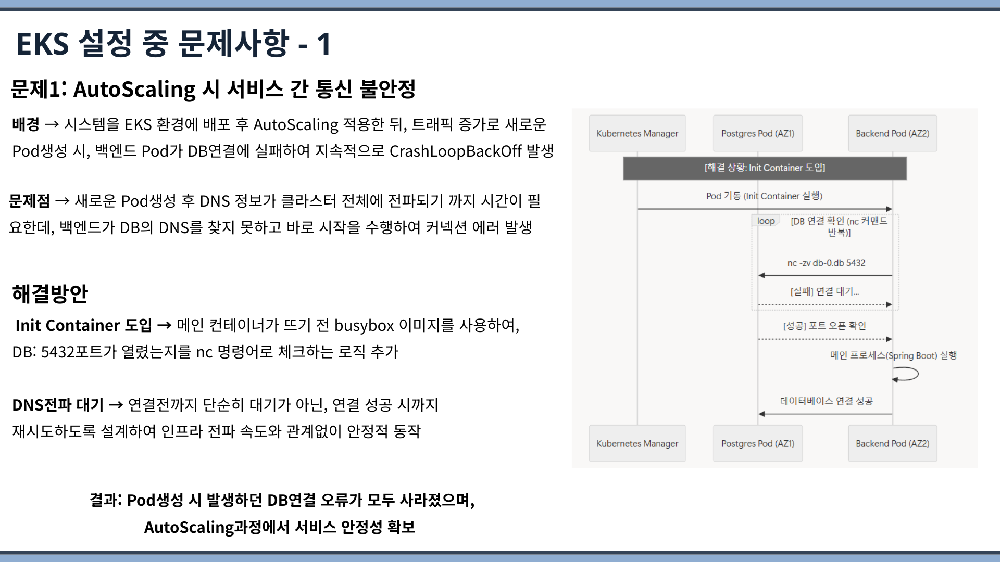
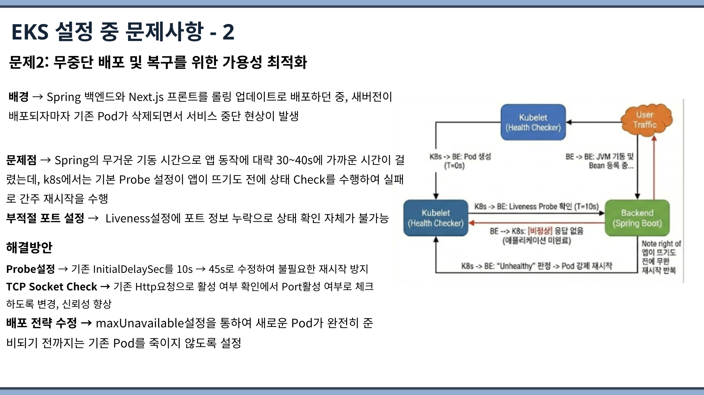

# 나만의 책장 서비스 (도서 관리 서비스)
[📄 포트폴리오 PDF 보기](.assets/KT%20AIVLE%20School%20Mini%20Project%205.pdf)

*Aivle School 8기 4차 미니 프로젝트*
1반 2조 

-----

## 🚀 프로젝트 소개

**나만의 책장 서비스**는 사용자가 직접 글을 작성해서 나만의 책을 만들고, AI를 이용해 표지 이미지를 생성하며, 외부 도서 정보(YES24)까지 검색할 수 있는 웹 서비스입니다.

본 프로젝트는 단순한 애플리케이션 개발에 그치지 않고, **AWS EKS(Elastic Kubernetes Service)를 기반으로 한 클라우드 네이티브 아키텍처**로 설계되었습니다. 무중단 배포, 자동 확장, 고가용성 보장 등 실제 서비스 운영 환경에 맞춘 인프라 구성과 CI/CD 파이프라인 구축에 중점을 두었습니다.

---

## 🏗️ 서비스 아키텍처 및 인프라 설계

단순한 기능 구현을 넘어, **실제 운영 환경에서 발생할 수 있는 트래픽 증가와 서버 장애에 유연하게 대응**할 수 있도록 AWS EKS(Kubernetes) 기반의 클라우드 네이티브 아키텍처를 설계했습니다.

### 1. 효율적인 트래픽 분산 (AWS Load Balancer & Nginx)

> **왜 이중 분산 구조인가?**  
> AWS NLB 하나만으로도 기본적인 트래픽 분산은 가능하지만, NLB는 L4(TCP)레벨까지만 처리할 수 있기때문에 URL 경로 기반의 라우팅(/api/와 /의 분리)이 불가합니다. 프론트엔드(Next.js)와 백엔드(Spring Boot)가 서로 다른 포트와 경로를 사용하는 마이크로서비스 구조이므로, **L7(HTTP) 레벨에서 경로를 식별하고 적절한 서비스로 분기하는 리버스 프록시(Nginx)**가 반드시 필요했습니다.

사용자 요청이 증가할 때 단일 서버에 부하가 집중되지 않도록 이중으로 분산 처리 구조를 짰습니다. 외부 진입점으로는 쿠버네티스의 `Service(Type: LoadBalancer)`를 선언하여 **AWS Load Balancer(NLB)**를 자동으로 띄워 외부 트래픽을 안전하게 받아냅니다. 이렇게 들어온 트래픽은 클러스터 내부의 **Nginx(L4/L7 라우터 역할)**로 전달되며, Nginx가 다시 백엔드 API와 프론트엔드 라우트로 나누어 전달(리버스 프록시)하도록 구성했습니다.

- `/api/*` → Spring Boot 백엔드 (`:8080`)
- `/` (그 외 요청) → Next.js 프론트엔드 (`:3000`)

### 2. 단일 장애점 극복과 고가용성 (High Availability)

> **왜 Topology Spread Constraints인가?**  
> 단순히 `replicas: 2`로 파드를 복제하더라도, 쿠버네티스 스케줄러가 두 파드를 같은 가용 영역(AZ)의 같은 노드에 배치할 수 있습니다. 이 경우 해당 AZ에 장애가 발생하면 복제본 모두가 동시에 중단되어 고가용성의 의미가 없어집니다. `topologySpreadConstraints`의 `maxSkew: 1`로 설정하면 파드가 가용 영역 간에 최대 1개 차이로 균등 분산되어, **특정 AZ 장애 시에도 다른 AZ에서 서비스가 계속 유지**됩니다.

특정 데이터센터(가용 영역)에 시스템 장애가 발생하더라도 전체 서비스가 중단되지 않도록 방어하는 데 집중했습니다. `Topology Spread Constraints` 속성을 적용하여 파드(Pod)들을 여러 가용 영역에 분산 배치하였고, 새로운 코드를 배포할 때도 서버를 멈추지 않게 롤링 업데이트(Rolling Update) 기반의 **무중단 배포**를 적용했습니다.

### 3. 장애 발생 시 자동 복구 (Health Check & Self-Healing)

> **왜 HTTP 헬스체크가 아닌 TCP Socket Check인가?**  
> Spring Boot는 JVM 위에서 구동되며 기동 시간이 30~40초 이상 소요됩니다. 기본 쿠버네티스 Probe 설정(initialDelaySeconds: 10s)으로는 애플리케이션이 아직 기동 중인데 헬스체크가 먼저 수행되어 "비정상"으로 판정, 무한 재시작 루프에 빠지는 문제가 발생했습니다. 이를 해결하기 위해 `initialDelaySeconds`를 45초로 충분히 확보하고, HTTP 요청 방식 대신 **TCP Socket(`tcpSocket`) 방식**으로 포트 활성 여부만 확인하여 보다 가벼우면서도 신뢰성 높은 헬스체크를 구현했습니다.

메모리 누수나 예상치 못한 에러로 애플리케이션이 멈출 경우, 수동 개입 없이 시스템이 스스로 정상화되는 데 초점을 맞췄습니다. 쿠버네티스의 `Liveness Probe`와 `Readiness Probe`를 활용해 주기적으로 헬스 체크를 진행하며, 응답 불가 상태의 파드는 스스로 재시작(Self-Healing)되도록 구성했습니다.

### 4. 트래픽 변화에 따른 유연한 자원 확장 (Auto Scaling)

> **왜 HPA와 Cluster Autoscaler를 함께 사용하는가?**  
> HPA(Horizontal Pod Autoscaler)만으로는 파드 수는 늘릴 수 있지만, 파드를 배치할 노드(EC2)의 자원이 부족하면 새 파드가 `Pending` 상태에 머무릅니다. 반대로 Cluster Autoscaler만으로는 노드 확장은 가능하지만, 개별 서비스의 세밀한 스케일링은 불가합니다. 따라서 **HPA가 CPU 사용률 50% 초과 시 파드를 최소 2개에서 최대 5개까지 자동 확장**하고, **Cluster Autoscaler가 노드 리소스 부족을 감지하면 EC2 인스턴스를 추가**하는 2단계 오토스케일링 전략을 채택했습니다.

이벤트 등으로 갑작스러운 트래픽 폭주가 발생해도 서비스가 버틸 수 있도록 유연한 인프라를 구축했습니다. Cluster Autoscaler(CA)를 구성하여 리소스가 한계에 다다르면 자동으로 서버(EC2 노드)를 늘려 대응(Scale-out)하고, 유휴 상태일 때는 자원을 회수하여 비용 효율성을 높였습니다.

> 위 이미지는 부하 테스트를 통한 Auto Scaling 검증 결과입니다. HPA 설정(CPU 50%, Min 2 → Max 5)에 따라 트래픽 증가 시 ReplicaSet 스케일링 이벤트가 트리거되어 자동으로 Pod 수가 증가하고, Cluster Autoscaler가 노드 리소스 부족 시 EC2를 추가하여 안정적인 서비스를 제공하는 것을 확인했습니다.

### 5. 데이터 영속성과 보안 유지 (Stateful & Secret)

> **왜 Deployment 대신 StatefulSet인가?**  
> 일반 `Deployment`로 DB를 운영하면, 파드가 재시작될 때마다 새로운 이름과 볼륨이 할당되어 기존 데이터와의 연결이 끊어질 수 있습니다. `StatefulSet`은 각 파드에 고정된 네트워크 ID(`db-0`)와 전용 PVC(Persistent Volume Claim)를 보장하므로, 파드가 재시작되더라도 **항상 동일한 EBS 볼륨에 재연결**되어 데이터 유실 없이 안정적으로 운영할 수 있습니다. 또한 Headless Service(`clusterIP: None`)를 사용하여 `db-0.db.default.svc.cluster.local`이라는 고정 DNS로 백엔드가 항상 정확한 DB 인스턴스에 접근할 수 있도록 했습니다.

애플리케이션을 구동하는 파드는 언제든 생성/삭제될 수 있어 저장소로 적합하지 않습니다. 따라서 도서 및 사용자 정보를 안전하게 보관하기 위해 `StatefulSet`과 AWS EBS 볼륨을 결합하여 PostgreSQL 데이터베이스 환경을 구성했습니다. 또한 DB 접근 계정과 같은 민감한 정보는 소스코드에서 분리하여 쿠버네티스 `Secret`으로 안전하게 주입되도록 처리했습니다.

---

## 🔄 무중단 자동 배포 파이프라인 (CI/CD)

수동 배포 과정에서 발생할 수 있는 휴먼 에러를 방지하고, 개발 생산성을 극대화하기 위해 **AWS 완전 관리형 서비스(CodePipeline, CodeBuild, ECR)**를 활용한 배포 자동화를 달성했습니다.

> **왜 Jenkins가 아닌 AWS 네이티브 CI/CD인가?**  
> Jenkins는 강력하지만 별도의 서버 구축·관리·업데이트가 필요하고, 플러그인 충돌 등 유지보수 비용이 높습니다. 이미 인프라 전체가 AWS EKS 위에서 동작하므로, **같은 AWS 생태계 안에서 IAM 역할 기반으로 권한을 통합 관리**하고 추가 서버 없이 완전 관리형으로 운영할 수 있는 CodePipeline + CodeBuild 조합을 선택했습니다. 이를 통해 인프라 관리 포인트를 최소화하면서도 GitHub → Build → ECR → EKS 배포까지의 자동화를 달성했습니다.

**[ 파이프라인 동작 흐름 ]**

1. **Source**: GitHub `main` 브랜치에 코드가 병합(Push)되면 AWS CodePipeline이 이를 자동으로 감지하여 빌드/배포 프로세스를 트리거합니다.
2. **Build & Push**: AWS CodeBuild가 `buildspec.yml` 설정에 맞춰 프론트엔드와 백엔드를 각각 새로운 도커(Docker) 이미지로 빌드합니다. 생성된 이미지는 AWS ECR(프라이빗 컨테이너 레지스트리)로 안전하게 전송됩니다.
3. **Deploy**: ECR에 등록된 최신 이미지를 바탕으로 EKS 클러스터에 배포 명령(`kubectl apply`)을 수행하여 롤링 업데이트 방식으로 실제 운영 환경에 무중단 반영됩니다.

**[ 파이프라인 설계 주안점 ]**
- **인프라 운영 최소화**: Jenkins 등의 별도 CI/CD 서버 구성 없이 AWS 네이티브 서비스를 활용하여 관리 포인트를 대폭 줄였습니다.
- **안정적인 롤백 지원**: 코드 빌드 시점의 Git 커밋 해시(Commit Hash)를 이미지 태그로 사용하여 버전을 식별합니다. 배포 후 예기치 않은 오류가 발생할 경우 확정된 이전 버전 이미지로 신속하게 롤백이 가능합니다.

---

## 🔥 트러블슈팅 (Troubleshooting)

EKS 기반 인프라를 구축하는 과정에서 마주한 핵심 문제들과 해결 과정을 정리했습니다.

### 문제 1: AutoScaling 시 서비스 간 통신 불안정

**배경**: 시스템을 EKS 환경에 배포 후 AutoScaling을 적용한 뒤, 트래픽 증가로 새로운 Pod가 생성될 때 백엔드 Pod가 DB 연결에 실패하여 지속적으로 `CrashLoopBackOff` 상태에 빠지는 현상이 발생했습니다.

**문제점**: 새로운 Pod 생성 후 DNS 정보가 클러스터 전체에 전파되기까지 시간이 필요한데, 백엔드가 DB의 DNS를 찾지 못하고 바로 시작을 시도하여 커넥션 에러가 반복 발생했습니다.

**해결방안**:
- **Init Container** 도입 → 메인 컨테이너(Spring Boot)가 뜨기 전, `busybox` 이미지를 사용하여 DB(5432 포트)가 실제로 열렸는지 `nc` 명령어로 반복 확인하는 사전 검증 로직을 추가했습니다.
- **DNS 전파 대기** → 단순히 일정 시간 대기가 아닌, 연결 성공 시까지 재시도하도록 설계하여 인프라 전파 속도와 관계없이 안정적으로 동작합니다.

> **결과**: Pod 생성 시 발생하던 DB 연결 오류가 모두 사라졌으며, AutoScaling 과정에서 서비스 안정성을 확보했습니다.

---

### 문제 2: 무중단 배포 및 복구를 위한 가용성 최적화

**배경**: Spring 백엔드와 Next.js 프론트엔드를 롤링 업데이트로 배포하던 중, 새 버전이 배포되자마자 기존 Pod가 삭제되면서 서비스 중단 현상이 발생했습니다.

**문제점**: Spring의 무거운 기동 시간으로 앱 동작에 대략 30~40초가 걸렸는데, k8s에서는 기본 Probe 설정이 앱이 뜨기도 전에 상태 Check를 수행하여 실패로 간주, 무한 재시작을 반복했습니다. 또한 Liveness 설정에 포트 정보가 누락되어 상태 확인 자체가 불가능했습니다.

**해결방안**:
- **Probe 설정 조정** → `initialDelaySeconds`를 10초에서 45초로 변경하여 Spring Boot의 기동 시간을 충분히 확보하고, 불필요한 재시작을 방지했습니다.
- **TCP Socket Check 전환** → 기존 HTTP 요청 방식에서 Port 활성 여부를 체크하는 TCP Socket 방식으로 변경하여 헬스체크의 신뢰성을 향상시켰습니다.
- **배포 전략 수정** → `maxUnavailable` 설정을 통해 새로운 Pod가 완전히 준비되기 전까지는 기존 Pod를 종료하지 않도록 하여 무중단 배포를 보장했습니다.

> **결과**: 롤링 업데이트 시 서비스 중단 없이 안정적인 무중단 배포가 가능해졌으며, 장애 복구(Self-Healing) 과정에서도 불필요한 재시작이 발생하지 않게 되었습니다.

---

## 💻 어플리케이션 주요 기능 요약

### 1. 사용자 인증 및 관리
- 회원가입 (이메일, 비밀번호 정책, 중복 검증) 및 이메일+비밀번호 기반 로그인 구현 (세션 기반).

### 2. 나만의 책 만들기 (CRUD)
- 도서 등록, 전체/상세 조회, 수정 및 삭제 기능 제공.

### 3. AI 표지 이미지 생성
- 도서 상세 정보 화면에서 **OpenAI API** 연동을 통해 책 제목/내용 기반 프롬프트를 자동 생성하고 이미지를 생성하여 화면에 제공. 선택 시 백엔드 DB와 연동하여 커버 정보(`coverImageUrl`)를 업데이트.

### 4. 실시간 YES24 도서 검색 연동
- K-웹 스크래핑 라이브러리 `Jsoup`을 활용해 사용자가 입력한 키워드로 YES24 외부 쇼핑몰의 책 제목, 저자, 이미지를 파싱하여 실시간 검색 결과 제공.

---

## 🛠 기술 스택

### Infrastructure & DevOps
- **Cloud/Infra**: AWS EKS, AWS ECR, AWS LoadBalancer, IAM, EBS
- **CI/CD**: AWS CodePipeline, AWS CodeBuild (`buildspec.yml`)
- **Container Orchestration**: Kubernetes (Deployment, StatefulSet, ConfigMap, Secret, Service)
- **Auto Scaling**: Kubernetes HPA (Horizontal Pod Autoscaler), Cluster Autoscaler

### Backend
- **Java 17, Spring Boot 3.5.8**, Spring Web, Spring Data JPA, Hibernate
- **Database**: PostgreSQL (EKS 환경), H2 (개발 환경)
- **Library**: Jsoup, Lombok, Gradle

### Frontend
- **Next.js (React 기반)**, React Hooks, MUI, Axios
